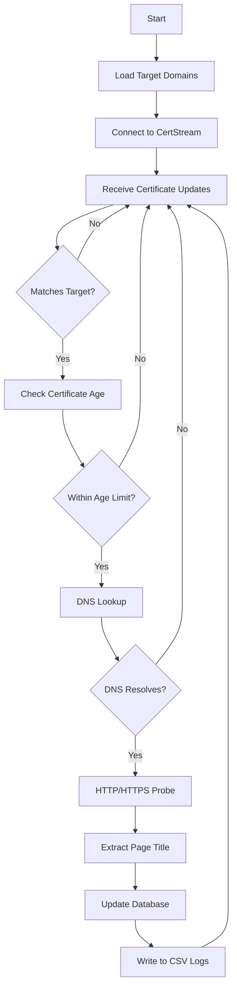

# 🔍 CertStream Monitor

[](https://golang.org)
[](LICENSE)
[](https://goreportcard.com/report/github.com/osamahamad/certstream-monitor)

Another Go tool that leverages certstream.calidog.io to monitor Certificate Transparency (CT) logs in real-time to discover subdomains for a given list of domains for research purposes within a specified domain age. Automatically probes discovered subdomains for liveness and extracts page titles.

> **Inspired by**: [nashcontrol/bounty-monitor](https://github.com/nashcontrol/bounty-monitor)

## ✨ Features

- 🚀 **Real-time CT Monitoring**: Live WebSocket connection to CertStream
- 🎯 **Target Filtering**: Only monitors subdomains matching your target domains
- 🔍 **Automatic Liveness Detection**: HTTP/HTTPS probing with configurable timeouts
- 📄 **Page Title Extraction**: Extracts and logs page titles from live subdomains
- 💾 **SQLite Database**: Persistent storage with first/last seen timestamps
- 📊 **CSV Export**: Both all subdomains and live-only exports
- ⏰ **Age Filtering**: Only process certificates seen within specified timeframe
- 🔄 **Auto-Reconnection**: Exponential backoff on connection drops
- ⚡ **High Performance**: Efficient DNS lookups and concurrent processing
- 🤖 **GitHub Actions**: Automated monitoring with Telegram notifications (5-hour runs every 6 hours) reporting to this channel [@certstream_monitor](https://t.me/certstream_monitor) and meant to target only program that offers rewards. 

## 🚀 Quick Start

### Prerequisites

- **Go 1.22+** ([Download](https://golang.org/dl/))
- **Internet connection** for CertStream access

## 🤖 GitHub Actions Automation

The repository includes a GitHub Actions workflow that automatically runs the certstream monitor and sends notifications. Perfect for continuous monitoring without keeping your machine running!

### Features

- ⏰ **Scheduled Runs**: Automatically runs every 6 hours for 5 hours to avoid hitting GitHub Action limits (max 6 hours per workflow)
- 🔔 **Telegram Notifications**: Sends live subdomain findings via Telegram to this public channel: [@certstream_monitor](https://t.me/certstream_monitor)
- 📊 **Results Tracking**: Commits monitoring results back to the repository
- 🎯 **Manual Triggers**: Can be triggered manually via GitHub Actions UI

### Setup

> ⚠️ **Important**: I highly recommend not running this in a private repository unless you're using a Self-Hosted GitHub Runner, as it will quickly consume your 3,000 minute limit on GitHub Cloud.

1. **Fork the repository** to your GitHub account
2. **Add your target domains** to `targets.txt`
3. **Configure Telegram notifications** (optional):
   - Create a Telegram bot via [@BotFather](https://t.me/botfather)
   - Get your chat ID
   - Add these secrets to your repository:
     - `TELEGRAM_BOT_TOKEN`: Your bot token
     - `TELEGRAM_CHAT_ID`: Your chat ID
4. **Enable GitHub Actions** in your repository settings
5. **Run the workflow** manually or wait for the scheduled run

### Workflow Details

The GitHub Action will:
- Run certstream-monitor for 5 hours (configurable)
- Send formatted notifications of live subdomains via Telegram
- Commit results back to the repository for tracking or future use.
- Include debug information in the logs

### Customization

Edit `.github/workflows/certstream-monitor.yml` to:
- Change the monitoring duration (`-run-for` parameter)
- Modify the cron schedule (currently every 6 hours)
- Adjust notification format
- Add additional notification channels

### Installation

#### Option 1: Local Installation

```bash
# Clone the repository
git clone https://github.com/osamahamad/certstream-monitor.git
cd certstream-monitor

# Install dependencies
go mod tidy

# Build the binary
go build -o certstream-monitor certstream.go

# Or install directly
go install github.com/osamahamad/certstream-monitor@latest
```

#### Option 2: GitHub Actions (Recommended for --Kind of-- Continuous Monitoring)

1. **Fork this repository** to your GitHub account
2. **Add your target domains** to `targets.txt`
3. **Configure Telegram notifications** (see GitHub Actions section below)
4. **Enable GitHub Actions** - The workflow will run automatically every 6 hours

### Basic Usage

```bash
# 1. Create a targets file
echo "example.com" > targets.txt
echo "target.com" >> targets.txt

# 2. Run the monitor
./certstream-monitor -list targets.txt -out ./output

# 3. Check results
ls -la output/
# subdomains.db, all_subdomains.log, live_subdomains.log
```

## 📖 Usage Guide

### Command Line Options

| Flag | Default | Description |
|------|---------|-------------|
| `-list` | `targets.txt` | Path to file containing target domains (one per line) |
| `-out` | `.` | Output directory for database and log files |
| `-age` | `90` | Only log to live_subdomains if cert seen within N days |
| `-insecure` | `true` | Skip TLS verification when probing HTTPS |
| `-probe-timeout` | `5s` | Timeout for HTTP/HTTPS liveness probes |
| `-https-only` | `false` | Probe only HTTPS (default: tries HTTP then HTTPS) |
| `-ws-timeout` | `15` | WebSocket dial timeout in seconds |
| `-run-for` | `0` (unlimited) | How long to stream before exiting (0 = unlimited) |
| `-certstream-url` | `wss://certstream.calidog.io` | CertStream WebSocket URL |

### Environment Variables

| Variable | Description |
|----------|-------------|
| `CERTSTREAM_URL` | Override the default CertStream WebSocket URL |

### Example Commands

```bash
# Monitor for 1 hour with HTTPS-only probing
./certstream-monitor -list targets.txt -out ./results -run-for 1h -https-only

# Use custom CertStream endpoint
CERTSTREAM_URL=wss://your-certstream.com ./certstream-monitor -list targets.txt

# Run with TLS verification enabled
./certstream-monitor -list targets.txt -insecure=false

# Monitor with 30-day age filter and custom timeout
./certstream-monitor -list targets.txt -age 30 -probe-timeout 10s

# Run for 2 hours with verbose output
./certstream-monitor -list targets.txt -run-for 2h -out ./monitoring_results
```

## 📝 Target File Format

Create a text file with one domain per line. Supports various formats:

```text
# Comments start with #
example.com
target.com
https://another-target.com
*.wildcard.com
subdomain.target.com
```

**Supported formats:**
- Bare domains: `example.com`
- URLs: `https://example.com`
- Wildcards: `*.example.com`
- Comments: Lines starting with `#`

## 📊 Output Files

The tool generates three output files in the specified directory:

| File | Description |
|------|-------------|
| `subdomains.db` | SQLite database with subdomain history |
| `all_subdomains.log` | CSV log of all discovered subdomains |
| `live_subdomains.log` | CSV log of only live subdomains |

### CSV Format

**all_subdomains.log**:
```csv
timestamp,host,first_seen,last_seen,domain_age_days,status,title,scheme
2024-01-15T10:30:00Z,subdomain.example.com,1705312200,1705312200,5,200,"Welcome to Example",https
```

**live_subdomains.log**:
```csv
timestamp,host,domain_age_days,status,title,scheme
2024-01-15T10:30:00Z,subdomain.example.com,5,200,"Welcome to Example",https
```

### Database Schema

```sql
CREATE TABLE subdomains(
  host TEXT PRIMARY KEY,
  first_seen INTEGER NOT NULL,  -- Unix timestamp
  last_seen  INTEGER NOT NULL,  -- Unix timestamp
  live       INTEGER NOT NULL DEFAULT 0  -- 1 if live, 0 if not
);
```

## 🔧 How It Works



1. **Connection**: Establishes WebSocket connection to CertStream
2. **Filtering**: Filters certificate updates for domains matching your targets
3. **Age Check**: Only processes certificates seen within the specified age window
4. **DNS Resolution**: Performs quick DNS lookup to filter out non-existent domains
5. **HTTP Probing**: Attempts HTTP and HTTPS connections to verify liveness
6. **Title Extraction**: Extracts page titles from successful HTTP responses
7. **Logging**: Records findings to database and CSV files
8. **Reconnection**: Automatically reconnects on connection drops

## 🛠️ Dependencies

- [certstream-go](https://github.com/bl4ko/certstream-go) - CertStream WebSocket client
- [modernc.org/sqlite](https://modernc.org/sqlite) - Pure Go SQLite driver
- [golang.org/x/net](https://golang.org/x/net) - Public suffix list utilities

## 🐛 Troubleshooting

### Common Issues

| Issue | Solution |
|-------|----------|
| **No subdomains found** | Check your targets file format and ensure domains are properly formatted |
| **Connection timeouts** | Increase `-ws-timeout` or check network connectivity |
| **TLS errors** | Use `-insecure` flag for internal/self-signed certificates |
| **High memory usage** | Reduce `-run-for` duration or add more specific domain filters |
| **Permission denied** | Ensure write permissions for output directory |
| **Database locked** | Close other processes accessing the SQLite database |

### Debug Mode

```bash
# Enable verbose logging
export DEBUG=1
./certstream-monitor -list targets.txt
```

### Performance Tips

- Use specific target domains to reduce noise
- Set appropriate `-age` values to filter old certificates
- Use `-https-only` for faster probing if you only need HTTPS
- Monitor disk space for large target lists

## 🤝 Contributing

Contributions are welcome to add BBP targets to targets.txt file in this repo. Just post in the PR with the program URL in the description ( The program must offer rewards and not a VDP ).

## 📄 License

This project is licensed under the MIT License - see the [LICENSE](LICENSE) file for details.

## 🙏 Acknowledgments

- [CertStream](https://certstream.calidog.io/) for providing the CT log stream
- [nashcontrol/bounty-monitor](https://github.com/nashcontrol/bounty-monitor) for inspiration


**⭐ Star this repository if you find it useful!**


